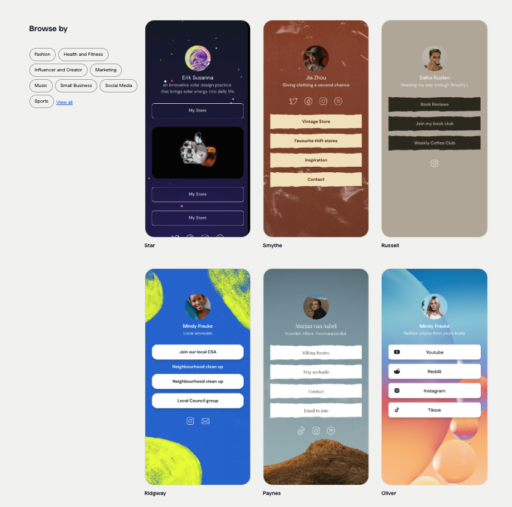

# Profile platform
#### A Modern portfolio for the Modern World. An Instragram app for the developer community.

### Tech Stack
- NextJS (Frontend + Backend)
- MongoDB (NoSQL DB)
- NextAuth for authentication

### Initial steps:

- Task 1 | Setup the codebase using create-next-app.
- Task 2 | Develop a static portfolio page to kick off the project. (Use Tailwind + Shadcn for CSS)
- Task 3 | Setup a MongoDB Instance on cloud and connect it to the codebase.
- Task 4 | Setup NextAuth (Cookie based authentication for now)
- Task 5 | Portfolio listing page.

Portfolio page to be minimal for now:
- Profile picture
- User name
- Caption
- 4 Social media icons with profile redirection
- Upto 2 link buttons that can redirect to user's project / business / anything they wish to emphasize.

The app should eventually have profile templates that users can select for their profile.

Something like this:

User can also create their own templates which can be reused by other users.
