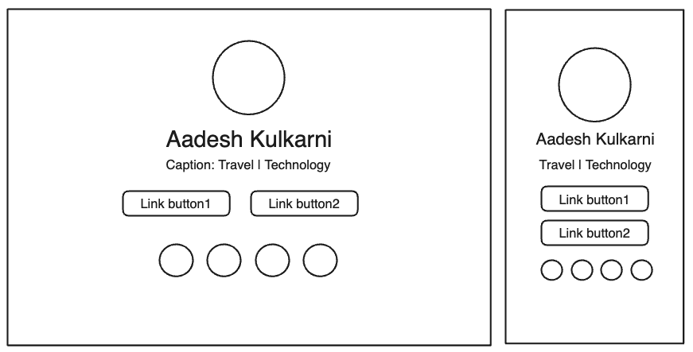

# Profile platform
#### A Modern portfolio for the Modern World. An Instragram app for the developer community.

### Tech Stack
- NextJS (Frontend + Backend)
- MongoDB (NoSQL DB)
- NextAuth for authentication

### Initial steps:

- Task 1 | Setup the codebase using create-next-app.
- Task 2 | Develop a static portfolio page to kick off the project. (Use Tailwind + Shadcn for CSS)
- Task 3 | Setup a MongoDB Instance on cloud and connect it to the codebase.
- Task 4 | Setup NextAuth (Cookie based authentication for now)

Portfolio page to be minimal for the start:

